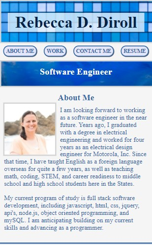
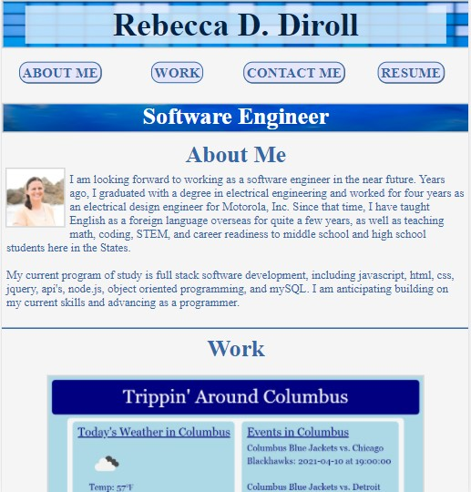
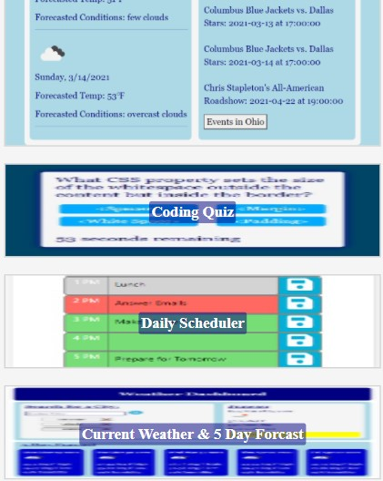

This project is an online, web-based portfolio that showcases the work that I have have done and the html, css, and javascript skills that I have built.

The portfolio contains the following elements:

1. Name
2. Navigation Links
3. Job Title
4. About Me section with photo and text
5. Work section with HTML, CSS, JavaScript, and Calculate areas where each have an image, title, hover effect, and a link to placeholder websites
6. Contact section with phone nubmer, email, GitHub, and LinkedIn links
7. Resume section
8. Footer section with nav links to the main sectons of the profile
9. Media queries and responsive design
10. Debug GitHub issues